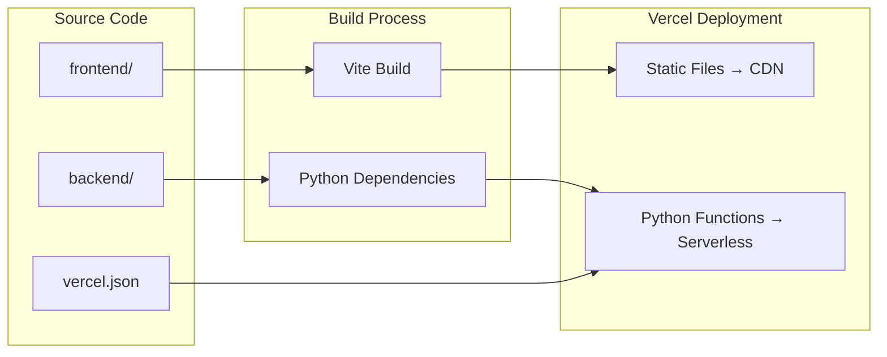

# Production Deployment Design Document

## Overview

This design document outlines the architecture and implementation strategy for deploying the Spooky RSS System to Vercel's free (Hobby) tier. The deployment must transform the current development setup into a production-ready application that operates within strict serverless constraints while maintaining functionality and user experience.

### Design Goals

1. **Zero-Cost Operation**: Stay within Vercel's free tier limits (1M invocations, 100GB bandwidth, 10s timeout)
2. **Serverless-First**: Adapt FastAPI backend to Vercel's serverless function model
3. **Stateless Architecture**: Eliminate dependency on persistent local filesystem
4. **Graceful Degradation**: Handle service failures without crashing
5. **Performance**: Optimize for fast cold starts and efficient execution

### Key Challenges

- **10-Second Timeout**: Narration generation can take 20-30 seconds with ElevenLabs
- **No Persistent Storage**: Vercel Blob/KV not available on free tier
- **Stateless Functions**: Each invocation starts fresh, no in-memory caching across requests
- **Cold Starts**: Python functions have slower cold start times
- **API Costs**: OpenRouter and ElevenLabs API calls cost money

## Architecture

### High-Level Architecture

```mermaid
graph TB
    subgraph "Vercel Edge Network"
        CDN[Static Assets CDN]
    end
    
    subgraph "Vercel Serverless Functions"
        API[/api/feeds]
        Health[/api/health]
        Narration[/api/narration]
    end
    
    subgraph "External Services"
        OpenRouter[OpenRouter API]
        ElevenLabs[ElevenLabs API]
        Storage[Optional: Cloudinary Free Tier]
    end
    
    User[User Browser] --> CDN
    User --> API
    User --> Health
    User --> Narration
    
    API --> OpenRouter
    Narration --> ElevenLabs
    Narration -.->|Optional| Storage
    
    CDN --> Frontend[React SPA]
```

### Deployment Architecture



## Components and Interfaces

### 1. Vercel Configuration (vercel.json)

The `vercel.json` file defines how Vercel builds and routes the application:

```json
{
  "version": 2,
  "builds": [
    {
      "src": "frontend/package.json",
      "use": "@vercel/static-build",
      "config": {
        "distDir": "frontend/dist"
      }
    },
    {
      "src": "api/**/*.py",
      "use": "@vercel/python"
    }
  ],
  "routes": [
    {
      "src": "/api/(.*)",
      "dest": "/api/$1"
    },
    {
      "src": "/(.*)",
      "dest": "/frontend/$1"
    }
  ],
  "env": {
    "OPENROUTER_API_KEY": "@openrouter_api_key",
    "ELEVENLABS_API_KEY": "@elevenlabs_api_key"
  }
}
```

### 2. API Directory Structure

Vercel requires a specific directory structure for serverless functions:

```
api/
├── __init__.py
├── health.py          # GET /api/health
├── feeds/
│   ├── __init__.py
│   ├── process.py     # POST /api/feeds/process
│   └── continue.py    # POST /api/feeds/continue
└── narration/
    ├── __init__.py
    ├── generate.py    # POST /api/narration/generate
    └── voices.py      # GET /api/narration/voices
```

Each Python file exports a `handler` function that Vercel invokes:

```python
# api/health.py
from http.server import BaseHTTPRequestHandler
import json

class handler(BaseHTTPRequestHandler):
    def do_GET(self):
        self.send_response(200)
        self.send_header('Content-type', 'application/json')
        self.end_headers()
        
        response = {
            "status": "healthy",
            "service": "spooky-rss-system"
        }
        
        self.wfile.write(json.dumps(response).encode())
```

### 3. FastAPI Adapter

Since Vercel's Python runtime doesn't natively support ASGI, we need an adapter:

```python
# api/_adapter.py
from fastapi import FastAPI
from mangum import Mangum

app = FastAPI()

# Import all routes
from backend.api.routes import feeds, narration, preferences

app.include_router(feeds.router, prefix="/api/feeds")
app.include_router(narration.router, prefix="/api/narration")
app.include_router(preferences.router, prefix="/api/preferences")

# Mangum adapter for serverless
handler = Mangum(app)
```

### 4. Frontend Build Configuration

Update `frontend/package.json` to include Vercel build script:

```json
{
  "scripts": {
    "dev": "vite",
    "build": "tsc -b && vite build",
    "vercel-build": "npm run build"
  }
}
```

### 5. Environment Variable Management

Create `.env.production` template:

```bash
# Required
OPENROUTER_API_KEY=
ELEVENLABS_API_KEY=

# Optional
OPENROUTER_MODEL=gpt-3.5-turbo
ENVIRONMENT=production
LOG_LEVEL=INFO

# Narration settings (adjusted for free tier)
NARRATION_ENABLED=true
NARRATION_MAX_CONCURRENT=1
NARRATION_MAX_CONTENT_LENGTH=5000
NARRATION_TIMEOUT=9
```

## Data Models

### Deployment Configuration Model

```python
from pydantic import BaseModel, Field
from typing import Optional

class DeploymentConfig(BaseModel):
    """Configuration for Vercel deployment"""
    environment: str = Field(default="production")
    is_serverless: bool = Field(default=True)
    function_timeout: int = Field(default=10, le=10)
    max_memory_mb: int = Field(default=1024, le=1024)
    enable_caching: bool = Field(default=False)
    external_storage_url: Optional[str] = None
    
    class Config:
        frozen = True
```

### Serverless Response Model

```python
from pydantic import BaseModel
from typing import Any, Dict, Optional

class ServerlessResponse(BaseModel):
    """Standard response format for serverless functions"""
    statusCode: int
    headers: Dict[str, str]
    body: str
    isBase64Encoded: bool = False
    
    @classmethod
    def success(cls, data: Any, headers: Optional[Dict[str, str]] = None):
        import json
        return cls(
            statusCode=200,
            headers=headers or {"Content-Type": "application/json"},
            body=json.dumps(data)
        )
    
    @classmethod
    def error(cls, message: str, status_code: int = 500):
        import json
        return cls(
            statusCode=status_code,
            headers={"Content-Type": "application/json"},
            body=json.dumps({"error": message})
        )
```

## Correctness Properties

*A property is a characteristic or behavior that should hold true across all valid executions of a system-essentially, a formal statement about what the system should do. Properties serve as the bridge between human-readable specifications and machine-verifiable correctness guarantees.*

### Property 1: Configuration validation on startup
*For any* missing required environment variable (OPENROUTER_API_KEY, ELEVENLABS_API_KEY), the application startup should fail with a clear error message indicating which variable is missing.
**Validates: Requirements 2.2**

### Property 2: Default values for optional configuration
*For any* optional configuration parameter that is omitted, the system should use a sensible default value without failing.
**Validates: Requirements 2.3**

### Property 3: Secret redaction in logs
*For any* log message containing sensitive data (API keys, tokens), the logged output should have those values redacted or masked.
**Validates: Requirements 2.5**

### Property 4: Security headers in responses
*For any* HTTP response from the backend, the response should include required security headers (X-Content-Type-Options, X-Frame-Options, Content-Security-Policy).
**Validates: Requirements 5.1**

### Property 5: Rate limiting enforcement
*For any* client making excessive requests, the system should throttle requests after exceeding the rate limit threshold.
**Validates: Requirements 5.3**

### Property 6: Error message sanitization
*For any* error response, the message should not expose internal implementation details such as file paths, stack traces, or database schemas.
**Validates: Requirements 5.5**

### Property 7: Storage failure resilience
*For any* external storage operation failure, the system should continue operating without cached data rather than crashing.
**Validates: Requirements 6.4, 6.5**

### Property 8: Retry with exponential backoff
*For any* failed external API call, the system should retry with exponentially increasing delays between attempts.
**Validates: Requirements 9.1**

### Property 9: Cache operations resilience
*For any* cache operation failure (read or write), the system should continue operation without cached data.
**Validates: Requirements 9.2**

### Property 10: User-friendly network error messages
*For any* network error (timeout, connection refused, DNS failure), the error message returned to users should be friendly and not expose technical details.
**Validates: Requirements 9.4**

### Property 11: API call caching
*For any* repeated request with identical parameters, the system should use cached results instead of making duplicate API calls to OpenRouter or ElevenLabs.
**Validates: Requirements 11.5**

## Error Handling

### Timeout Handling Strategy

Since Vercel's free tier has a 10-second timeout, we must handle long-running operations:

```python
import asyncio
from typing import Optional

class TimeoutHandler:
    """Handles operations that might exceed serverless timeout"""
    
    def __init__(self, timeout_seconds: int = 9):
        self.timeout = timeout_seconds
    
    async def execute_with_timeout(self, coro, fallback_message: str):
        """Execute coroutine with timeout, return fallback on timeout"""
        try:
            return await asyncio.wait_for(coro, timeout=self.timeout)
        except asyncio.TimeoutError:
            return {
                "error": "timeout",
                "message": fallback_message,
                "suggestion": "This operation takes longer than our serverless limit. Try reducing content length or disabling narration."
            }
```

### Graceful Degradation

```python
class FeatureFlags:
    """Manage feature availability based on service health"""
    
    def __init__(self):
        self.narration_enabled = True
        self.story_continuation_enabled = True
    
    async def check_elevenlabs_health(self) -> bool:
        """Check if ElevenLabs is available"""
        try:
            # Quick health check
            response = await self.client.get("/health", timeout=2)
            return response.status_code == 200
        except:
            self.narration_enabled = False
            return False
    
    def get_available_features(self) -> dict:
        return {
            "narration": self.narration_enabled,
            "story_continuation": self.story_continuation_enabled
        }
```

### Error Response Standardization

```python
from enum import Enum
from pydantic import BaseModel

class ErrorCode(str, Enum):
    TIMEOUT = "TIMEOUT"
    RATE_LIMIT = "RATE_LIMIT"
    EXTERNAL_API_FAILURE = "EXTERNAL_API_FAILURE"
    INVALID_INPUT = "INVALID_INPUT"
    SERVICE_UNAVAILABLE = "SERVICE_UNAVAILABLE"

class ErrorResponse(BaseModel):
    error_code: ErrorCode
    message: str
    user_message: str
    retry_after: Optional[int] = None
    
    @classmethod
    def timeout_error(cls):
        return cls(
            error_code=ErrorCode.TIMEOUT,
            message="Operation exceeded 10-second serverless limit",
            user_message="This operation is taking too long. Try reducing the content length or number of feeds."
        )
    
    @classmethod
    def rate_limit_error(cls, retry_after: int):
        return cls(
            error_code=ErrorCode.RATE_LIMIT,
            message="Rate limit exceeded",
            user_message=f"You've made too many requests. Please wait {retry_after} seconds.",
            retry_after=retry_after
        )
```

## Testing Strategy

### Unit Testing

Unit tests will verify specific behaviors and edge cases:

1. **Configuration Tests**
   - Test environment variable loading
   - Test missing required variables raise errors
   - Test optional variables use defaults
   - Test production mode disables debug

2. **Security Tests**
   - Test security headers are present in responses
   - Test CORS configuration blocks unauthorized origins
   - Test error messages don't leak sensitive data
   - Test API keys are redacted in logs

3. **Error Handling Tests**
   - Test timeout handling returns user-friendly messages
   - Test external API failures are handled gracefully
   - Test cache failures don't crash the application
   - Test ElevenLabs unavailability disables narration

4. **Health Check Tests**
   - Test health endpoint returns 200 when healthy
   - Test health endpoint returns 503 when services fail

### Property-Based Testing

Property-based tests will verify universal behaviors across many inputs using the `hypothesis` library for Python:

1. **Configuration Property Tests**
   - Property 2: Default values for optional configuration
   - Property 3: Secret redaction in logs

2. **Security Property Tests**
   - Property 4: Security headers in responses
   - Property 5: Rate limiting enforcement
   - Property 6: Error message sanitization

3. **Resilience Property Tests**
   - Property 7: Storage failure resilience
   - Property 8: Retry with exponential backoff
   - Property 9: Cache operations resilience
   - Property 10: User-friendly network error messages

4. **Optimization Property Tests**
   - Property 11: API call caching

### Integration Testing

Integration tests will verify the deployment works end-to-end:

1. **Deployment Tests**
   - Test Vercel build completes successfully
   - Test all API routes are accessible
   - Test frontend loads and renders

2. **Performance Tests**
   - Test functions complete within 10-second timeout
   - Test cold start times are acceptable
   - Test response sizes stay within bandwidth limits

## Implementation Strategy

### Phase 1: Restructure for Serverless

1. Create `api/` directory with Vercel-compatible structure
2. Implement Mangum adapter for FastAPI
3. Split monolithic backend into individual function files
4. Remove filesystem dependencies (cache directory)

### Phase 2: Configuration Management

1. Create `vercel.json` configuration file
2. Set up environment variables in Vercel dashboard
3. Implement configuration validation on startup
4. Add production-specific settings

### Phase 3: Optimize for Constraints

1. Implement timeout handling for long operations
2. Add rate limiting to prevent quota exhaustion
3. Optimize response sizes to reduce bandwidth
4. Implement request caching to minimize API calls

### Phase 4: Frontend Deployment

1. Configure Vite for production builds
2. Optimize bundle sizes with code splitting
3. Configure API base URL for production
4. Test frontend deployment

### Phase 5: Testing and Validation

1. Write unit tests for new serverless adapters
2. Write property-based tests for correctness properties
3. Test deployment in Vercel preview environment
4. Validate all features work within constraints

### Phase 6: Documentation

1. Create deployment guide with step-by-step instructions
2. Document all environment variables
3. Create troubleshooting guide
4. Add architecture diagrams

## Deployment Process

### Initial Setup

1. **Install Vercel CLI**
   ```bash
   npm install -g vercel
   ```

2. **Login to Vercel**
   ```bash
   vercel login
   ```

3. **Link Project**
   ```bash
   vercel link
   ```

4. **Set Environment Variables**
   ```bash
   vercel env add OPENROUTER_API_KEY
   vercel env add ELEVENLABS_API_KEY
   ```

### Deployment Commands

```bash
# Deploy to preview
vercel

# Deploy to production
vercel --prod

# View logs
vercel logs

# Check deployment status
vercel inspect
```

### Continuous Deployment

Connect GitHub repository to Vercel for automatic deployments:

1. Push code to GitHub
2. Vercel automatically detects changes
3. Builds and deploys preview for PRs
4. Deploys to production on merge to main

## Performance Optimization

### Cold Start Optimization

```python
# Minimize imports at module level
# Use lazy imports for heavy dependencies

def handler(request):
    # Import only when needed
    if request.path == "/api/narration/generate":
        from backend.narration import voice_service
        return voice_service.generate(request)
```

### Response Size Optimization

```python
class ResponseOptimizer:
    """Optimize response sizes to reduce bandwidth"""
    
    @staticmethod
    def compress_response(data: dict) -> dict:
        """Remove unnecessary fields from response"""
        # Remove verbose fields
        if "debug_info" in data:
            del data["debug_info"]
        
        # Truncate long strings
        if "content" in data and len(data["content"]) > 10000:
            data["content"] = data["content"][:10000] + "..."
        
        return data
```

### Caching Strategy

Since we can't use Vercel KV on free tier, implement client-side caching:

```typescript
// frontend/src/services/cache.ts
class ClientCache {
  private cache: Map<string, { data: any; timestamp: number }> = new Map();
  private ttl: number = 5 * 60 * 1000; // 5 minutes
  
  get(key: string): any | null {
    const entry = this.cache.get(key);
    if (!entry) return null;
    
    if (Date.now() - entry.timestamp > this.ttl) {
      this.cache.delete(key);
      return null;
    }
    
    return entry.data;
  }
  
  set(key: string, data: any): void {
    this.cache.set(key, { data, timestamp: Date.now() });
  }
}
```

## Monitoring and Observability

### Logging Strategy

```python
import logging
import json
from typing import Any, Dict

class StructuredLogger:
    """Structured logging for serverless environment"""
    
    def __init__(self, service_name: str):
        self.logger = logging.getLogger(service_name)
        self.service_name = service_name
    
    def log(self, level: str, message: str, **kwargs):
        """Log structured JSON to stdout"""
        log_entry = {
            "service": self.service_name,
            "level": level,
            "message": message,
            "timestamp": datetime.utcnow().isoformat(),
            **kwargs
        }
        
        # Redact sensitive data
        log_entry = self._redact_secrets(log_entry)
        
        print(json.dumps(log_entry))
    
    def _redact_secrets(self, data: Dict[str, Any]) -> Dict[str, Any]:
        """Redact API keys and secrets from logs"""
        sensitive_keys = ["api_key", "token", "password", "secret"]
        
        for key in data:
            if any(sensitive in key.lower() for sensitive in sensitive_keys):
                data[key] = "***REDACTED***"
        
        return data
```

### Metrics Tracking

```python
class MetricsCollector:
    """Track usage metrics to stay within free tier limits"""
    
    def __init__(self):
        self.invocation_count = 0
        self.bandwidth_used = 0
    
    def record_invocation(self):
        """Record function invocation"""
        self.invocation_count += 1
        
        # Warn if approaching limits
        if self.invocation_count > 900000:  # 90% of 1M limit
            logging.warning(f"Approaching invocation limit: {self.invocation_count}/1000000")
    
    def record_bandwidth(self, bytes_sent: int):
        """Record bandwidth usage"""
        self.bandwidth_used += bytes_sent
        
        # Warn if approaching limits
        gb_used = self.bandwidth_used / (1024 ** 3)
        if gb_used > 90:  # 90% of 100GB limit
            logging.warning(f"Approaching bandwidth limit: {gb_used:.2f}/100 GB")
```

## Security Considerations

### Security Headers Middleware

```python
from fastapi import Request
from starlette.middleware.base import BaseHTTPMiddleware

class SecurityHeadersMiddleware(BaseHTTPMiddleware):
    """Add security headers to all responses"""
    
    async def dispatch(self, request: Request, call_next):
        response = await call_next(request)
        
        # Security headers
        response.headers["X-Content-Type-Options"] = "nosniff"
        response.headers["X-Frame-Options"] = "DENY"
        response.headers["X-XSS-Protection"] = "1; mode=block"
        response.headers["Strict-Transport-Security"] = "max-age=31536000; includeSubDomains"
        response.headers["Content-Security-Policy"] = "default-src 'self'"
        
        return response
```

### Rate Limiting

```python
from collections import defaultdict
from datetime import datetime, timedelta

class RateLimiter:
    """Simple in-memory rate limiter"""
    
    def __init__(self, max_requests: int = 100, window_seconds: int = 60):
        self.max_requests = max_requests
        self.window = timedelta(seconds=window_seconds)
        self.requests = defaultdict(list)
    
    def is_allowed(self, client_id: str) -> bool:
        """Check if request is allowed"""
        now = datetime.utcnow()
        
        # Clean old requests
        self.requests[client_id] = [
            req_time for req_time in self.requests[client_id]
            if now - req_time < self.window
        ]
        
        # Check limit
        if len(self.requests[client_id]) >= self.max_requests:
            return False
        
        # Record request
        self.requests[client_id].append(now)
        return True
```

### CORS Configuration

```python
from fastapi.middleware.cors import CORSMiddleware

def configure_cors(app: FastAPI, environment: str):
    """Configure CORS based on environment"""
    
    if environment == "production":
        # Restrict to production domain
        origins = ["https://your-domain.vercel.app"]
    else:
        # Allow localhost in development
        origins = ["http://localhost:5173", "http://localhost:3000"]
    
    app.add_middleware(
        CORSMiddleware,
        allow_origins=origins,
        allow_credentials=True,
        allow_methods=["GET", "POST", "PUT", "DELETE"],
        allow_headers=["*"],
    )
```

## Migration and Deployment

### Pre-Deployment Checklist

- [ ] All environment variables configured in Vercel
- [ ] `vercel.json` created and tested
- [ ] Frontend builds successfully
- [ ] Backend adapters implemented
- [ ] Tests passing
- [ ] Documentation updated
- [ ] Rate limiting implemented
- [ ] Security headers configured
- [ ] Error handling tested
- [ ] Timeout handling implemented

### Deployment Steps

1. **Prepare Repository**
   ```bash
   git add .
   git commit -m "Prepare for Vercel deployment"
   git push origin main
   ```

2. **Deploy to Preview**
   ```bash
   vercel
   ```

3. **Test Preview Deployment**
   - Test all API endpoints
   - Test frontend functionality
   - Verify environment variables
   - Check logs for errors

4. **Deploy to Production**
   ```bash
   vercel --prod
   ```

5. **Post-Deployment Verification**
   - Test production URL
   - Monitor logs for errors
   - Check performance metrics
   - Verify all features work

### Rollback Strategy

If deployment fails:

```bash
# List deployments
vercel ls

# Rollback to previous deployment
vercel rollback [deployment-url]
```

## Troubleshooting Guide

### Common Issues

1. **Function Timeout**
   - **Symptom**: 504 Gateway Timeout errors
   - **Solution**: Reduce content length, disable narration, or implement async processing

2. **Cold Start Delays**
   - **Symptom**: First request takes 5-10 seconds
   - **Solution**: Optimize imports, reduce dependencies, implement warming strategy

3. **Rate Limit Exceeded**
   - **Symptom**: 429 Too Many Requests
   - **Solution**: Implement client-side rate limiting, add caching

4. **Build Failures**
   - **Symptom**: Deployment fails during build
   - **Solution**: Check build logs, verify dependencies, test locally

5. **Environment Variables Not Found**
   - **Symptom**: Application fails to start
   - **Solution**: Verify variables in Vercel dashboard, redeploy

### Debug Commands

```bash
# View real-time logs
vercel logs --follow

# Inspect deployment
vercel inspect [deployment-url]

# Test function locally
vercel dev

# Check environment variables
vercel env ls
```

## Cost Optimization

### Staying Within Free Tier

1. **Monitor Usage**
   - Track invocations daily
   - Monitor bandwidth usage
   - Set up alerts at 80% of limits

2. **Optimize Requests**
   - Implement aggressive caching
   - Reduce response sizes
   - Batch operations where possible

3. **Feature Gating**
   - Make narration optional
   - Limit story continuation length
   - Implement usage quotas per user

4. **External API Optimization**
   - Cache OpenRouter responses
   - Disable ElevenLabs if quota exceeded
   - Use cheaper AI models

### Alternative Storage Solutions

If caching is needed, consider free alternatives:

1. **Cloudinary Free Tier**
   - 25 GB storage
   - 25 GB bandwidth/month
   - Good for audio files

2. **Supabase Free Tier**
   - 500 MB database
   - 1 GB file storage
   - Good for metadata

3. **Client-Side Storage**
   - localStorage for preferences
   - IndexedDB for larger data
   - No server costs

## Conclusion

This design provides a comprehensive approach to deploying the Spooky RSS System on Vercel's free tier. The key strategies are:

1. **Serverless Adaptation**: Convert FastAPI to Vercel-compatible functions
2. **Constraint Management**: Work within 10-second timeout and storage limitations
3. **Graceful Degradation**: Handle failures without crashing
4. **Cost Optimization**: Stay within free tier limits through caching and rate limiting
5. **Security**: Implement proper headers, CORS, and error handling

The implementation will require careful testing and monitoring to ensure the application performs well within the constraints of the free tier while maintaining a good user experience.
