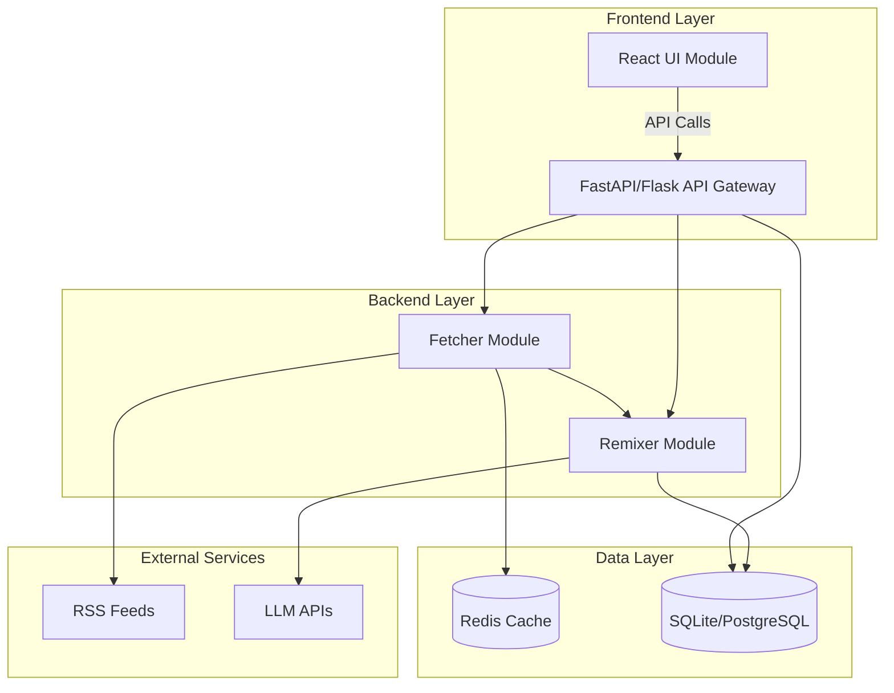
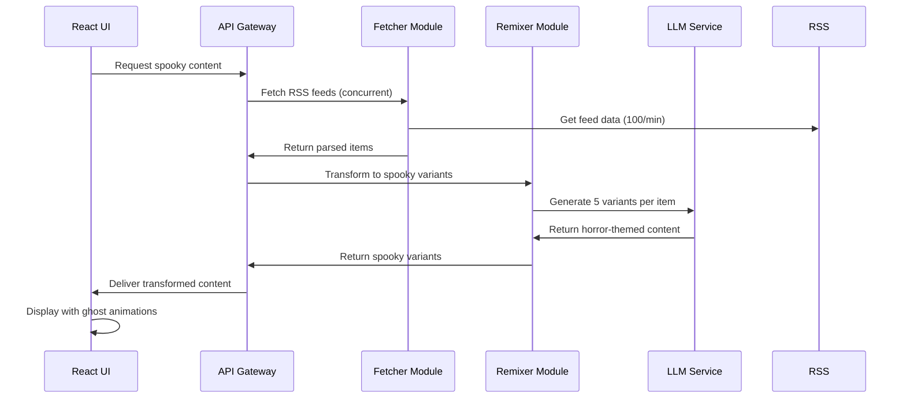
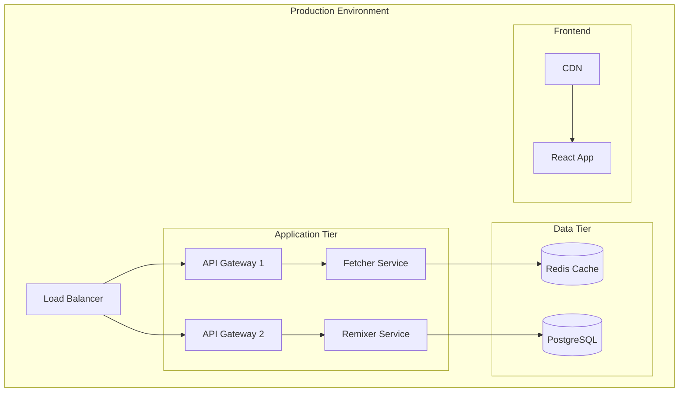

# Design Document

## Overview

The Spooky RSS System is a three-tier architecture application that transforms traditional RSS content into horror-themed narratives. The system consists of a Python-based backend for RSS processing and AI transformation, a React frontend for user interaction, and API endpoints that coordinate between modules. The design leverages existing RSS parsing capabilities while adding concurrent processing, user personalization, and atmospheric UI elements.

## Architecture

### System Architecture Diagram



### Module Interaction Flow



## Components and Interfaces

### 1. Fetcher Module (Enhanced)

**Technology**: Python with asyncio for concurrent processing
**Base Implementation**: Extends existing `SpookyRSSParser` class

```python
class ConcurrentFetcher:
    async def fetch_feeds_concurrent(self, urls: List[str]) -> List[FeedItem]
    async def fetch_single_feed(self, url: str) -> List[FeedItem]
    def validate_feed_format(self, feed_data: dict) -> bool
    def handle_feed_errors(self, url: str, error: Exception) -> List[FeedItem]
```

**Key Features**:
- Async/await pattern for 100+ feeds/minute processing
- Connection pooling with aiohttp
- Exponential backoff retry mechanism
- Feed validation and error recovery
- Rate limiting and throttling controls

### 2. Remixer Module (New Implementation)

**Technology**: Python with OpenAI/OpenRouter integration
**Extends**: Current LLM integration in `SpookyRSSParser`

```python
class SpookyRemixer:
    def generate_variants(self, item: FeedItem, count: int = 5) -> List[SpookyVariant]
    def apply_horror_tropes(self, content: str, tropes: List[str]) -> str
    def personalize_content(self, content: str, preferences: UserPreferences) -> str
    def batch_process_items(self, items: List[FeedItem]) -> List[SpookyVariant]
```

**Horror Trope Categories**:
- Gothic Horror: haunted locations, ancient curses, supernatural entities
- Psychological Horror: mind manipulation, reality distortion, paranoia
- Cosmic Horror: otherworldly forces, incomprehensible entities
- Folk Horror: rural mysteries, pagan rituals, nature-based threats

### 3. UI Module (React Application)

**Technology**: React 18 with TypeScript, Framer Motion for animations

```typescript
interface UIComponents {
  FeedList: React.FC<{feeds: SpookyFeed[]}>
  SpookyCard: React.FC<{variant: SpookyVariant}>
  GhostNotification: React.FC<{message: string}>
  PreferencesPanel: React.FC<{onUpdate: (prefs: UserPreferences) => void}>
  DarkThemeProvider: React.FC<{children: ReactNode}>
}
```

**Animation System**:
- Ghost sprites using CSS animations and Framer Motion
- Floating particles background effect
- Fade-in/fade-out transitions for content updates
- Hover effects with eerie transformations

### 4. API Gateway

**Technology**: FastAPI for high-performance async API
**Endpoints**:

```python
@app.post("/api/feeds/process")
async def process_feeds(urls: List[str]) -> ProcessingResponse

@app.get("/api/variants/{feed_id}")
async def get_spooky_variants(feed_id: str) -> List[SpookyVariant]

@app.post("/api/preferences")
async def update_user_preferences(prefs: UserPreferences) -> StatusResponse

@app.get("/api/health")
async def health_check() -> HealthStatus
```

## Data Models

### Core Data Structures

```python
@dataclass
class FeedItem:
    title: str
    summary: str
    link: str
    published: datetime
    source: str
    metadata: Dict[str, Any]

@dataclass
class SpookyVariant:
    original_item: FeedItem
    haunted_title: str
    haunted_summary: str
    horror_themes: List[str]
    supernatural_explanation: str
    personalization_applied: bool
    generation_timestamp: datetime

@dataclass
class UserPreferences:
    preferred_horror_types: List[str]
    intensity_level: int  # 1-5 scale
    content_filters: List[str]
    notification_settings: Dict[str, bool]
    theme_customizations: Dict[str, str]

@dataclass
class ProcessingStats:
    feeds_processed: int
    variants_generated: int
    processing_time: float
    success_rate: float
    error_count: int
```

### Database Schema

```sql
-- SQLite/PostgreSQL compatible schema
CREATE TABLE feeds (
    id INTEGER PRIMARY KEY,
    url TEXT UNIQUE NOT NULL,
    title TEXT,
    last_fetched TIMESTAMP,
    status TEXT DEFAULT 'active'
);

CREATE TABLE feed_items (
    id INTEGER PRIMARY KEY,
    feed_id INTEGER REFERENCES feeds(id),
    title TEXT NOT NULL,
    summary TEXT,
    link TEXT,
    published TIMESTAMP,
    processed BOOLEAN DEFAULT FALSE
);

CREATE TABLE spooky_variants (
    id INTEGER PRIMARY KEY,
    feed_item_id INTEGER REFERENCES feed_items(id),
    haunted_title TEXT NOT NULL,
    haunted_summary TEXT NOT NULL,
    horror_themes JSON,
    created_at TIMESTAMP DEFAULT CURRENT_TIMESTAMP
);

CREATE TABLE user_preferences (
    id INTEGER PRIMARY KEY,
    user_id TEXT UNIQUE,
    preferences JSON,
    updated_at TIMESTAMP DEFAULT CURRENT_TIMESTAMP
);
```

## Error Handling

### Fetcher Module Error Handling

```python
class FeedErrorHandler:
    def handle_connection_timeout(self, url: str) -> FeedItem
    def handle_invalid_feed_format(self, url: str, data: str) -> FeedItem
    def handle_rate_limit_exceeded(self, url: str) -> None
    def create_ghost_feed_items(self, url: str, error: Exception) -> List[FeedItem]
```

**Error Recovery Strategies**:
- Exponential backoff for temporary failures
- Circuit breaker pattern for consistently failing feeds
- Ghost article generation for permanently dead feeds
- Graceful degradation with cached content

### Remixer Module Error Handling

```python
class RemixerErrorHandler:
    def handle_llm_api_failure(self, item: FeedItem) -> SpookyVariant
    def handle_rate_limit_exceeded(self) -> None
    def handle_content_filtering_rejection(self, content: str) -> str
    def fallback_horror_generation(self, item: FeedItem) -> SpookyVariant
```

**LLM Integration Resilience**:
- Multiple LLM provider fallbacks (OpenRouter, OpenAI, local models)
- Request queuing with priority handling
- Content caching to reduce API calls
- Template-based fallback generation

### UI Error Handling

```typescript
interface ErrorBoundaryState {
  hasError: boolean;
  errorMessage: string;
  errorType: 'network' | 'parsing' | 'rendering';
}

class SpookyErrorBoundary extends React.Component<Props, ErrorBoundaryState> {
  // Themed error displays with spooky messaging
  // Retry mechanisms for failed requests
  // Offline mode with cached content
}
```

## Testing Strategy

### Unit Testing

**Fetcher Module Tests**:
- RSS parsing accuracy with various feed formats
- Concurrent processing performance under load
- Error handling for malformed feeds
- Rate limiting compliance

**Remixer Module Tests**:
- Horror trope application consistency
- Personalization algorithm accuracy
- LLM API integration reliability
- Content quality validation

**UI Module Tests**:
- Component rendering with various data states
- Animation performance and smoothness
- Dark theme consistency across components
- User interaction flows

### Integration Testing

**End-to-End Workflows**:
- Complete feed processing pipeline
- User preference application across modules
- Error propagation and recovery
- Performance under concurrent load

**API Testing**:
- Endpoint response validation
- Authentication and authorization
- Rate limiting enforcement
- Error response formatting

### Performance Testing

**Load Testing Scenarios**:
- 100+ feeds processed per minute
- Concurrent user sessions
- LLM API rate limit handling
- Memory usage under sustained load

**Metrics to Monitor**:
- Feed processing latency
- Variant generation time
- UI rendering performance
- API response times
- Error rates by component

## Implementation Considerations

### Scalability

- **Horizontal Scaling**: Containerized modules with Docker
- **Caching Strategy**: Redis for feed data and generated variants
- **Load Balancing**: Multiple API gateway instances
- **Database Optimization**: Indexed queries and connection pooling

### Security

- **API Key Management**: Environment variables and secret management
- **Input Validation**: Sanitization of RSS content and user inputs
- **Rate Limiting**: Per-user and per-endpoint throttling
- **Content Filtering**: Inappropriate content detection and handling

### Monitoring and Observability

- **Logging**: Structured logging with correlation IDs
- **Metrics**: Prometheus-compatible metrics collection
- **Health Checks**: Comprehensive system health monitoring
- **Alerting**: Automated alerts for system failures

### Deployment Architecture



This design provides a robust, scalable foundation for the Spooky RSS System while building upon the existing codebase and meeting all specified requirements.