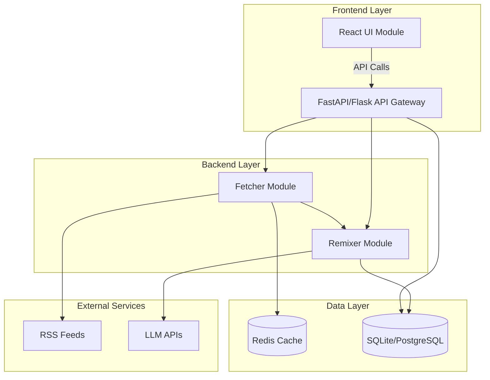
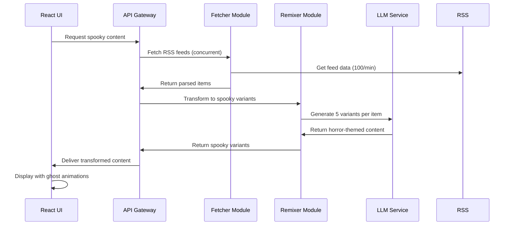
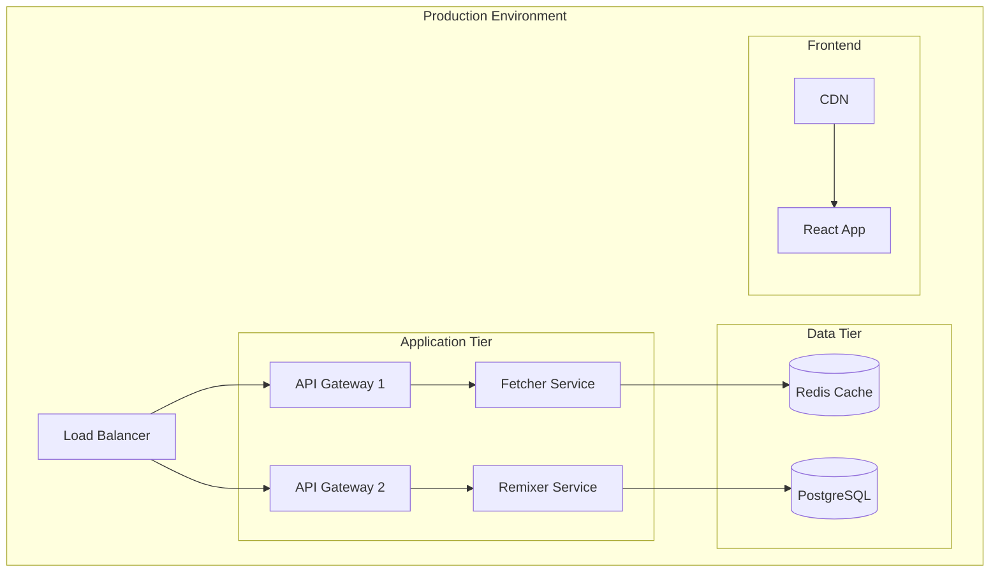

# Design Document

## Overview

The Spooky RSS System is a three-tier architecture application that transforms traditional RSS content into horror-themed narratives. The system consists of a Python-based backend for RSS processing and AI transformation, a React frontend for user interaction, and API endpoints that coordinate between modules. The design leverages existing RSS parsing capabilities while adding concurrent processing, user personalization, and atmospheric UI elements.

## Architecture

### System Architecture Diagram



### Module Interaction Flow



## Components and Interfaces

### 1. Fetcher Module (Enhanced)

**Technology**: Python with asyncio for concurrent processing
**Base Implementation**: Extends existing `SpookyRSSParser` class

```python
class ConcurrentFetcher:
    async def fetch_feeds_concurrent(self, urls: List[str]) -> List[FeedItem]
    async def fetch_single_feed(self, url: str) -> List[FeedItem]
    def validate_feed_format(self, feed_data: dict) -> bool
    def handle_feed_errors(self, url: str, error: Exception) -> List[FeedItem]
```

**Key Features**:
- Async/await pattern for 100+ feeds/minute processing
- Connection pooling with aiohttp
- Exponential backoff retry mechanism
- Feed validation and error recovery
- Rate limiting and throttling controls

### 2. Remixer Module (Enhanced Implementation)

**Technology**: Python with OpenAI/OpenRouter integration, DALL-E/Stable Diffusion for images
**Extends**: Current LLM integration in `SpookyRSSParser`

```python
class SpookyRemixer:
    def generate_variants(self, item: FeedItem, count: int = 5, intensity: int = 3) -> List[SpookyVariant]
    def apply_horror_tropes(self, content: str, tropes: List[str]) -> str
    def personalize_content(self, content: str, preferences: UserPreferences) -> str
    def batch_process_items(self, items: List[FeedItem]) -> List[SpookyVariant]
    def generate_horror_image(self, variant: SpookyVariant) -> str
    def continue_story(self, variant: SpookyVariant, continuation_length: int = 500) -> str
    def apply_intensity_level(self, content: str, intensity: int) -> str
```

**Horror Trope Categories**:
- Gothic Horror: haunted locations, ancient curses, supernatural entities
- Psychological Horror: mind manipulation, reality distortion, paranoia
- Cosmic Horror: otherworldly forces, incomprehensible entities
- Folk Horror: rural mysteries, pagan rituals, nature-based threats

**Intensity Level System**:
1. **Gentle Whisper**: Subtle hints, mild unease, mysterious atmosphere
2. **Creeping Dread**: Growing tension, ominous foreshadowing, unsettling details
3. **Dark Shadows**: Clear supernatural elements, moderate fear, disturbing imagery
4. **Nightmare Fuel**: Intense horror, graphic descriptions, psychological terror
5. **Absolute Terror**: Maximum horror intensity, existential dread, overwhelming darkness

**Image Generation**:
- AI-generated horror imagery using DALL-E or Stable Diffusion APIs
- Prompt engineering based on horror themes and content
- Fallback to atmospheric placeholder images
- Image caching to reduce API costs

### 3. UI Module (React Application)

**Technology**: React 18 with TypeScript, Framer Motion for animations, Howler.js for audio

```typescript
interface UIComponents {
  FeedList: React.FC<{feeds: SpookyFeed[]}>
  SpookyCard: React.FC<{variant: SpookyVariant}>
  GhostNotification: React.FC<{message: string}>
  PreferencesPanel: React.FC<{onUpdate: (prefs: UserPreferences) => void}>
  DarkThemeProvider: React.FC<{children: ReactNode}>
  SupernaturalReveal: React.FC<{explanation: string}>
  ParallaxContainer: React.FC<{children: ReactNode}>
  SpookyParticles: React.FC<{type: 'bats' | 'fog' | 'spirits'}>
  IntensitySlider: React.FC<{value: number, onChange: (v: number) => void}>
  ExportMenu: React.FC<{variant: SpookyVariant}>
  ShareButtons: React.FC<{variant: SpookyVariant}>
  LoadingSpinner: React.FC<{message?: string}>
  HorrorImageDisplay: React.FC<{imageUrl: string, alt: string}>
  StoryContinuation: React.FC<{variant: SpookyVariant, onContinue: () => void}>
}
```

**Animation System**:
- Ghost sprites using CSS animations and Framer Motion
- Floating particles background effect with parallax scrolling
- Dramatic reveal animations for supernatural explanations
- Fade-in/fade-out transitions for content updates
- Hover effects with eerie transformations
- Loading state animations with atmospheric effects

**Audio System**:
- Contextual sound effects using Howler.js
- Ghostly whispers on hover interactions
- Creaking door sounds on card expansions
- Ambient atmospheric audio loops
- Volume controls and mute functionality

### 4. API Gateway (Enhanced)

**Technology**: FastAPI for high-performance async API
**Endpoints**:

```python
@app.post("/api/feeds/process")
async def process_feeds(urls: List[str], intensity: int = 3) -> ProcessingResponse

@app.get("/api/variants/{feed_id}")
async def get_spooky_variants(feed_id: str) -> List[SpookyVariant]

@app.post("/api/preferences")
async def update_user_preferences(prefs: UserPreferences) -> StatusResponse

@app.get("/api/health")
async def health_check() -> HealthStatus

@app.post("/api/variants/{variant_id}/continue")
async def continue_story(variant_id: str, length: int = 500) -> StoryContinuation

@app.get("/api/variants/{variant_id}/image")
async def get_horror_image(variant_id: str) -> ImageResponse

@app.get("/api/export/json")
async def export_json(variant_ids: List[str]) -> JSONExport

@app.get("/api/export/rss")
async def export_rss(variant_ids: List[str]) -> RSSExport

@app.post("/api/share/generate")
async def generate_share_link(variant_id: str) -> ShareLinkResponse
```

## Data Models

### Core Data Structures

```python
@dataclass
class FeedItem:
    title: str
    summary: str
    link: str
    published: datetime
    source: str
    metadata: Dict[str, Any]

@dataclass
class SpookyVariant:
    original_item: FeedItem
    haunted_title: str
    haunted_summary: str
    horror_themes: List[str]
    supernatural_explanation: str
    personalization_applied: bool
    generation_timestamp: datetime
    intensity_level: int  # 1-5 scale
    horror_image_url: Optional[str]
    continuation_available: bool

@dataclass
class UserPreferences:
    preferred_horror_types: List[str]
    intensity_level: int  # 1-5 scale
    content_filters: List[str]
    notification_settings: Dict[str, bool]
    theme_customizations: Dict[str, str]
    sound_enabled: bool
    parallax_enabled: bool

@dataclass
class StoryContinuation:
    variant_id: str
    continued_narrative: str
    continuation_timestamp: datetime
    maintains_intensity: bool

@dataclass
class ShareLink:
    variant_id: str
    share_url: str
    preview_image_url: str
    preview_title: str
    preview_description: str
    expires_at: datetime

@dataclass
class ProcessingStats:
    feeds_processed: int
    variants_generated: int
    processing_time: float
    success_rate: float
    error_count: int
```

### Database Schema

```sql
-- SQLite/PostgreSQL compatible schema
CREATE TABLE feeds (
    id INTEGER PRIMARY KEY,
    url TEXT UNIQUE NOT NULL,
    title TEXT,
    last_fetched TIMESTAMP,
    status TEXT DEFAULT 'active'
);

CREATE TABLE feed_items (
    id INTEGER PRIMARY KEY,
    feed_id INTEGER REFERENCES feeds(id),
    title TEXT NOT NULL,
    summary TEXT,
    link TEXT,
    published TIMESTAMP,
    processed BOOLEAN DEFAULT FALSE
);

CREATE TABLE spooky_variants (
    id INTEGER PRIMARY KEY,
    feed_item_id INTEGER REFERENCES feed_items(id),
    haunted_title TEXT NOT NULL,
    haunted_summary TEXT NOT NULL,
    horror_themes JSON,
    created_at TIMESTAMP DEFAULT CURRENT_TIMESTAMP
);

CREATE TABLE user_preferences (
    id INTEGER PRIMARY KEY,
    user_id TEXT UNIQUE,
    preferences JSON,
    updated_at TIMESTAMP DEFAULT CURRENT_TIMESTAMP
);
```

## Error Handling

### Fetcher Module Error Handling

```python
class FeedErrorHandler:
    def handle_connection_timeout(self, url: str) -> FeedItem
    def handle_invalid_feed_format(self, url: str, data: str) -> FeedItem
    def handle_rate_limit_exceeded(self, url: str) -> None
    def create_ghost_feed_items(self, url: str, error: Exception) -> List[FeedItem]
```

**Error Recovery Strategies**:
- Exponential backoff for temporary failures
- Circuit breaker pattern for consistently failing feeds
- Ghost article generation for permanently dead feeds
- Graceful degradation with cached content

### Remixer Module Error Handling

```python
class RemixerErrorHandler:
    def handle_llm_api_failure(self, item: FeedItem) -> SpookyVariant
    def handle_rate_limit_exceeded(self) -> None
    def handle_content_filtering_rejection(self, content: str) -> str
    def fallback_horror_generation(self, item: FeedItem) -> SpookyVariant
```

**LLM Integration Resilience**:
- Multiple LLM provider fallbacks (OpenRouter, OpenAI, local models)
- Request queuing with priority handling
- Content caching to reduce API calls
- Template-based fallback generation

### UI Error Handling

```typescript
interface ErrorBoundaryState {
  hasError: boolean;
  errorMessage: string;
  errorType: 'network' | 'parsing' | 'rendering';
}

class SpookyErrorBoundary extends React.Component<Props, ErrorBoundaryState> {
  // Themed error displays with spooky messaging
  // Retry mechanisms for failed requests
  // Offline mode with cached content
}
```

## Testing Strategy

### Unit Testing

**Fetcher Module Tests**:
- RSS parsing accuracy with various feed formats
- Concurrent processing performance under load
- Error handling for malformed feeds
- Rate limiting compliance

**Remixer Module Tests**:
- Horror trope application consistency
- Personalization algorithm accuracy
- LLM API integration reliability
- Content quality validation

**UI Module Tests**:
- Component rendering with various data states
- Animation performance and smoothness
- Dark theme consistency across components
- User interaction flows

### Integration Testing

**End-to-End Workflows**:
- Complete feed processing pipeline
- User preference application across modules
- Error propagation and recovery
- Performance under concurrent load

**API Testing**:
- Endpoint response validation
- Authentication and authorization
- Rate limiting enforcement
- Error response formatting

### Performance Testing

**Load Testing Scenarios**:
- 100+ feeds processed per minute
- Concurrent user sessions
- LLM API rate limit handling
- Memory usage under sustained load

**Metrics to Monitor**:
- Feed processing latency
- Variant generation time
- UI rendering performance
- API response times
- Error rates by component

## Enhanced Features Design

### Supernatural Explanation Reveal Animation

**Implementation Approach**:
- Collapsible section with dramatic reveal using Framer Motion
- Staggered text animation with fade-in and slide effects
- Pulsing glow effect around the explanation container
- Optional sound effect trigger on reveal

```typescript
const SupernaturalReveal: React.FC<{explanation: string}> = ({explanation}) => {
  return (
    <motion.div
      initial={{opacity: 0, height: 0}}
      animate={{opacity: 1, height: 'auto'}}
      transition={{duration: 0.8, ease: 'easeOut'}}
      className="supernatural-reveal"
    >
      <motion.p
        initial={{opacity: 0, y: 20}}
        animate={{opacity: 1, y: 0}}
        transition={{delay: 0.3, duration: 0.6}}
      >
        {explanation}
      </motion.p>
    </motion.div>
  );
};
```

### Parallax Scrolling with Spooky Particles

**Particle System Architecture**:
- Multiple particle layers with different scroll speeds
- Canvas-based rendering for performance
- Three particle types: bats, fog, spirits
- Configurable density and animation speed

```typescript
interface ParticleConfig {
  type: 'bats' | 'fog' | 'spirits';
  count: number;
  speed: number;
  parallaxFactor: number;
}

class ParticleSystem {
  private particles: Particle[] = [];
  private canvas: HTMLCanvasElement;
  
  constructor(config: ParticleConfig) {
    this.initializeParticles(config);
  }
  
  update(scrollY: number): void {
    // Update particle positions based on scroll
  }
  
  render(): void {
    // Render particles to canvas
  }
}
```

### Sound Effects System

**Audio Architecture**:
- Howler.js for cross-browser audio support
- Preloaded sound sprite for performance
- Context-aware sound triggering
- Volume control and mute functionality

```typescript
class SoundManager {
  private sounds: Map<string, Howl>;
  private enabled: boolean = true;
  
  constructor() {
    this.loadSounds();
  }
  
  play(soundName: 'whisper' | 'creak' | 'ambient'): void {
    if (!this.enabled) return;
    this.sounds.get(soundName)?.play();
  }
  
  setVolume(volume: number): void {
    Howler.volume(volume);
  }
  
  toggle(): void {
    this.enabled = !this.enabled;
  }
}
```

**Sound Assets**:
- Ghostly whispers (hover effects)
- Creaking doors (card expansions)
- Ambient horror loops (background)
- Notification chimes (spooky variants)

### Export Functionality

**JSON Export Format**:
```json
{
  "export_version": "1.0",
  "export_timestamp": "2025-11-10T12:00:00Z",
  "variants": [
    {
      "id": "variant_123",
      "haunted_title": "...",
      "haunted_summary": "...",
      "supernatural_explanation": "...",
      "horror_themes": ["gothic", "psychological"],
      "intensity_level": 3,
      "original_source": "https://..."
    }
  ]
}
```

**RSS Export Format**:
- Standard RSS 2.0 format with custom namespaces
- Horror-specific metadata in custom tags
- Importable by standard RSS readers
- Preserves all spooky transformations

### Social Media Sharing

**Share Implementation**:
- Generate unique shareable URLs with preview cards
- Open Graph meta tags for rich previews
- Twitter Card support
- Copy-to-clipboard functionality
- Direct sharing to major platforms (Twitter, Facebook, Reddit)

```typescript
interface ShareConfig {
  variant: SpookyVariant;
  platform: 'twitter' | 'facebook' | 'reddit' | 'clipboard';
}

async function shareVariant(config: ShareConfig): Promise<void> {
  const shareUrl = await generateShareLink(config.variant.id);
  
  switch (config.platform) {
    case 'twitter':
      window.open(`https://twitter.com/intent/tweet?url=${shareUrl}`);
      break;
    case 'clipboard':
      await navigator.clipboard.writeText(shareUrl);
      break;
    // ... other platforms
  }
}
```

### Loading States

**Loading State Components**:
- Skeleton screens for content loading
- Animated loading spinners with spooky themes
- Progress indicators for batch operations
- Contextual loading messages

```typescript
const LoadingStates = {
  FeedProcessing: <SpookySpinner message="Summoning dark forces..." />,
  ImageGeneration: <SpookySpinner message="Conjuring nightmares..." />,
  StoryContinuation: <SpookySpinner message="Extending the horror..." />,
  Export: <SpookySpinner message="Preparing your terrors..." />
};
```

### Horror Intensity Levels

**Intensity Implementation**:
- Slider component with 5 distinct levels
- Real-time preview of intensity changes
- Persistent intensity preference
- Visual indicators for each level

```python
class IntensityProcessor:
    INTENSITY_PROMPTS = {
        1: "Add subtle mysterious elements and mild unease",
        2: "Include growing tension and ominous foreshadowing",
        3: "Apply clear supernatural elements with moderate fear",
        4: "Generate intense horror with graphic descriptions",
        5: "Create maximum horror with existential dread"
    }
    
    def apply_intensity(self, content: str, level: int) -> str:
        prompt = self.INTENSITY_PROMPTS[level]
        return self.llm.transform(content, prompt)
```

### AI-Generated Horror Imagery

**Image Generation Pipeline**:
1. Extract key horror themes from variant
2. Construct image generation prompt
3. Call DALL-E or Stable Diffusion API
4. Cache generated image
5. Serve via CDN or local storage

```python
class HorrorImageGenerator:
    def __init__(self, api_key: str):
        self.client = OpenAI(api_key=api_key)
    
    async def generate_image(self, variant: SpookyVariant) -> str:
        prompt = self.construct_prompt(variant)
        
        response = await self.client.images.generate(
            model="dall-e-3",
            prompt=prompt,
            size="1024x1024",
            quality="standard",
            style="vivid"
        )
        
        return response.data[0].url
    
    def construct_prompt(self, variant: SpookyVariant) -> str:
        themes = ", ".join(variant.horror_themes)
        return f"Dark horror illustration: {variant.haunted_title}. Themes: {themes}. Atmospheric, cinematic, terrifying."
```

**Fallback Strategy**:
- Placeholder horror images for failed generations
- Retry mechanism with exponential backoff
- Alternative image sources (Unsplash horror collection)

### Story Continuation

**Continuation System**:
- "Continue the nightmare" button on each variant
- LLM generates 300-500 word continuation
- Maintains narrative consistency and horror themes
- Preserves intensity level from original
- Appends seamlessly to existing content

```python
class StoryContinuator:
    def continue_story(self, variant: SpookyVariant, length: int = 500) -> str:
        context = {
            "original_title": variant.haunted_title,
            "original_summary": variant.haunted_summary,
            "supernatural_explanation": variant.supernatural_explanation,
            "horror_themes": variant.horror_themes,
            "intensity_level": variant.intensity_level
        }
        
        prompt = self.build_continuation_prompt(context, length)
        continuation = self.llm.generate(prompt)
        
        return continuation
```

## Implementation Considerations

### Scalability

- **Horizontal Scaling**: Containerized modules with Docker
- **Caching Strategy**: Redis for feed data and generated variants
- **Load Balancing**: Multiple API gateway instances
- **Database Optimization**: Indexed queries and connection pooling

### Security

- **API Key Management**: Environment variables and secret management
- **Input Validation**: Sanitization of RSS content and user inputs
- **Rate Limiting**: Per-user and per-endpoint throttling
- **Content Filtering**: Inappropriate content detection and handling

### Monitoring and Observability

- **Logging**: Structured logging with correlation IDs
- **Metrics**: Prometheus-compatible metrics collection
- **Health Checks**: Comprehensive system health monitoring
- **Alerting**: Automated alerts for system failures

### Deployment Architecture



This design provides a robust, scalable foundation for the Spooky RSS System while building upon the existing codebase and meeting all specified requirements.